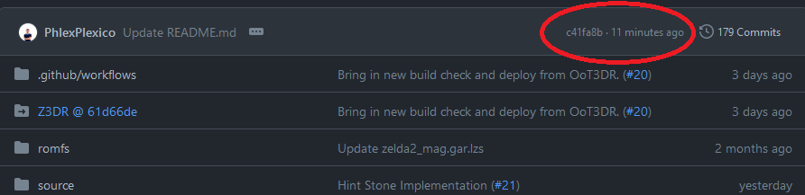

# FAQ
These are some commonly asked questions and answers that we have run across when helping users setup the Randomizer.

## Will this patch work with Project Restoration?
**No** - since these are both game patches they will interfere with each other and crash. There are however some options in the randomizer that brought over some features that you can choose to enable. *Please ensure that you remove the Project Restoration patch before applying the Randomizer*. This includes the `code.bps` file under `/luma/<title_id>/code.bps`.

## How do I see my dungeon key counts or which dungeon has which reward?
By pressing `SELECT` (by default) in game you can bring up a menu which will show you dungeon information.

## Are there plans to unpatch any other glitches like ISG?
No. The reason ISG is unpatched is because we happened to stumble upon the patch that Grezzo made for it and thought it would be funny if we took it away. We aren't actively looking to specifically unpatch any glitches.

## How do I find the most recent nightly build?
Github is a bit weird and won't list nightly builds in the exact order they were created. The latest nightly build will always start with the commit hash that's seen at the top of the repository in this location: 

Whichever nightly build begins with the characters in that location is the latest nightly build. You may have to scroll down on the list of nightly builds to find it.  

## Detailed Logic Abbreviations
SCT = South Clock Town
LP  = Laundry Pool
ECT = East Clock Town
SPI = StockPotInn
WCT = West Clock Town
NCT = North Clock Town
TF  = Termina Field
SS  = Southern Swamp
DP  = Deku Palace
WF  = Woodfall
MV  = Mountain Village
SH  = Snowhead
TI  = Twin Islands (Road to Goron Village)
GV  = Goron Village
MR  = Milk Road
RR  = Romani Ranch
GBC = Great Bay Coast
PR  = Pinnacle Rock
ZC  = Zora Coast
ZH  = Zora Hall
IC  = Ikana Canyon
IG  = Ikana Graveyard
IST = Inverted Stone Tower
SSH = Swamp Spider House
OSH = Ocean Spider House

## How do I know which version of the game I should select when generating a randomzier?
Use this following guide to determine which version to select:

- 1.0 (release day cart or eshop download) - Works with 1.0 patch generation
- 1.0 + 1.1 patch (release day cart or eshop download + patch downloaded) - Works with 1.0 patch generation
- 1.1 game (non release cartridge or 1.1 Rom) - Works with 1.1 patch generation only

How do I know if I have a version 1.1 cart?

When starting the vanilla game you will see Tatl on the Title Screen and will say Version 1.1 on the bottom left of the top screen.

## Will I lose my dungeon keys if I play song of time?
No! All your dungeon items (Keys, Compasses, Maps, Fairies) will remain in your inventory if you play Song Of Time. Doors with locks will also remain open if you play Song of Time.

## What about my trade items?
Trade items are also kept through cycles as well! You can also hold multiple deeds, and the letter to kafei/pendant of memories all at the same time. To swap these, click on your Gear screen and press L/R on the first and second slot to cycle through them. Once used, they will be removed from your inventory.

## Can I start the game without a sword or shield?
Yes you can! In the Starting Inventory options change the "Equipment & Upgrades" option to "Choose" then change the Sword or Shield option to "None"
Starting without a sword or shield will add an extra sword or shield to the item pool for placement so you don't lose out on having all items

## Can I start the game without an ocarina?
Yes you can! In the Starting Inventory options change the "Equipment & Upgrades" option to "Choose" then change the Sword or Shield option to "None" 
Starting without an ocarina forces the ocarina to be placed in a restricted set of locations (list coming soon) to ensure ability to obtain before end of day 3.

## I Randomized my Ocarina/Song of Time but am having issues finding it, Is there a list of locations it can be in?
Yes! See the spoiler hidden list below for a full list of allowed locations for the Ocarina/Song of Time:
??? note "List of spoiler locations"
    - Song of Healing
    - Ocarina of Time
    - Song of Time
    - Deku Mask
    - Bombers Notebook
    - DP West Garden HP
    - DP Bean Grotto Chest
    - ECT Archery 1
    - ECT Archery 2
    - ECT Mayor Reward
    - ECT Honey and Darling 3 Days
    - ECT Treasure Chest Game (Goron)
    - Bombers' Hideout Chest
    - ECT Chest
    - *Clock Town Postboxes* (North + South + East)
    - GV Powder Keg Challenge
    - GV Lens of Truth Chest
    - GV Deku Scrub Merchant Trade
    - GV Piece of Heart
    - GV Lens Cave Invisible Chest
    - GV Lens Cave Rock Chest
    - LP Bremen Mask
    - MR Gorman's Mystery Milk Quest
    - MV Razor Sword
    - MV Gilded Sword
    - NCT Great Fairy (Deku)
    - *Keaton Quizzes* (Clock Town + Milk Road)
    - NCT Deku Playground 3 Days Reward
    - NCT Tree
    - NCT Old Lady
    - NCT Great Fairy (Human)
    - Road to Snowhead Grotto
    - Road to Southern Swamp Archery 1
    - Road to Southern Swamp Archery 2
    - Road to Southern Swamp Tree
    - Road to Southern Swamp Grotto
    - RR Dog Race
    - RR Grog
    - RR Doggy Racetrack Roof Chest - Maybe change to trick jump?
    - SCT Scrub Trade
    - SCT Clock Tower Entrance
    - SCT Straw Roof Chest
    - SCT Final Day Chest
    - SCT Bank Reward 1
    - SS Koume
    - SS Kotake
    - SS Deku Scrub Merchant Trade
    - SS Pictograph Contest Winner
    - SS Tourist Center Roof
    - SS Near Spider House Grotto
    - SS Mystery Woods Grotto
    - SPI Toilet Hand
    - SPI Grandma Short Story
    - SPI Grandma Long Story
    - SPI Guest Room Chest
    - TF Moon's Tear
    - TF Peahat Grotto Chest
    - TF Dodongo Grotto Chest
    - TF Bio Baba Grotto HP
    - TF Kamaro
    - TF Pillar Grotto Chest
    - TF Grass Grotto Chest
    - TF Underwater Chest
    - TF Grass Chest
    - TF Stump Chest
    - TI Hot Spring Water Grotto Chest
    - WCT Postman's Game
    - WCT Rosa Sisters
    - WCT Swordman's School
    - WF Bridge Chest
    - WF Behind Owl Chest
    - WF Entrance to Woodfall Chest
    - *All 30 Gold Skulltulas in SSH* (The spiders themselves not the reward for getting 30 tokens)
    - Clock Town Tingle 1
    - Clock Town Tingle 2
    - Road to Swamp Tingle 1
    - Road to Swamp Tingle 2
    - Twin Islands Tingle 1
    - Twin Islands Tingle 2
    - Milk Road Tingle 1
    - Milk Road Tingle 2